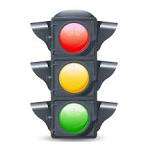

# 🚦 Dynamic Signals: AI-Powered Smart Traffic Control

This project presents a smart traffic control system using AI and computer vision to dynamically manage traffic signals based on real-time vehicle detection from video inputs.

---

## 📌 Features

- 🧠 Vehicle detection using **YOLOv8 (Ultralytics)**
- 🚨 Emergency vehicle detection with prioritized signals
- 🎨 Interactive GUI built with **Tkinter**
- 📈 Real-time traffic signal control and status logs
- 📊 Dynamic green signal duration based on traffic density

---

## 🖥️ GUI Preview



---

## 📂 Project Structure

```plaintext
├── main.py                  # Main GUI interface
├── vehicle_detection.py     # Vehicle detection logic with YOLOv8
├── centroid_tracker.py      # Centroid Tracker for tracking vehicles across frames
├── signal_control.py        # Deprecated (legacy signal display logic)
├── signals.jpeg             # Screenshot or sample traffic image
├── tempCodeRunnerFile.py    # Backup/test file
└── README.md                # This file
